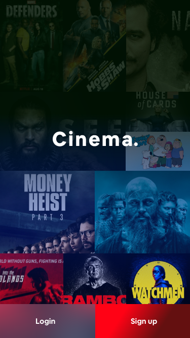
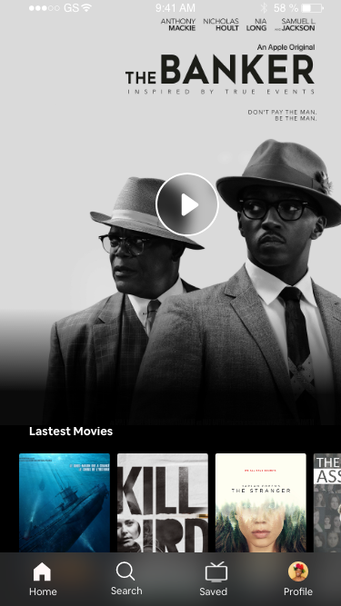
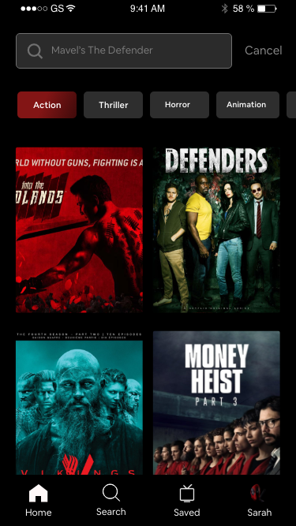

###


[](https://github.com/toelapiut/cinema/LICENSE)
[](https://GitHub.com/toelapiut)


We all sometimes want to escape from the daily routine such as watching a movie. This conceptual  app will help you to 
relax while watching a movie, series or cartoon. You only need to choose a movie or make use of the recommendations.

Cinema is loaded with cool features from the introduction logo with the transition to the main onboarding screen. 
The application offers the most interesting movies around the world and free directory only cinematography. A huge 
collection of films of all genres. Everything is completely free.






## Getting Started

The project is currently under progress so any person who wants to join and help in completion of the project is invited.

### Prerequisites
Just before you jump to the project get the environments right.

```
node v12.16.1
expo v3.30.9
package-manager(yarn or npm)
```

### Installing

After creating the Prerequisites ready to clone the project

First, clone cinema project using http and ssh respectively

```
git@github.com:toelapiut/cinema-app.git
https://github.com/toelapiut/cinema-app.git
```

Then enter into the cinema directory and use install the packages using your favourite package-manager ```yarn``` or 
```npm```. 
After which you can run the command 

```
expo start:android
expo start:ios
expo start:web --https
```

## Built With:

* [React Native](https://reactnative.dev/) - The hybrid framework used
* [React Navigation](https://rometools.github.io/rome/) - Used in navigation
* [Styled Component](https://styled-components.com/docs/basics#react-native) - Used in the styling of components
* [React Native Reanimated](https://software-mansion.github.io/react-native-reanimated/) - Used to Animate components without dropping frames
* [Firestore](https://console.firebase.google.com/) -Used as DB
* [Yarn](https://yarnpkg.com/) - Dependency Management

## Contributing

Please read [CONTRIBUTING.md](CONTRIBUTING.md) for details on our code of conduct, and the process for submitting pull requests to us.


## Authors

* **[Apiut Toel](https://github.com/toelapiut)** - *Initial work*


## License

This project is licensed under the MIT License - see the [LICENSE.md](LICENSE.md) file for details

## Acknowledgments

* Hulu
* Showmax
* Hat tip to anyone whose code was used


